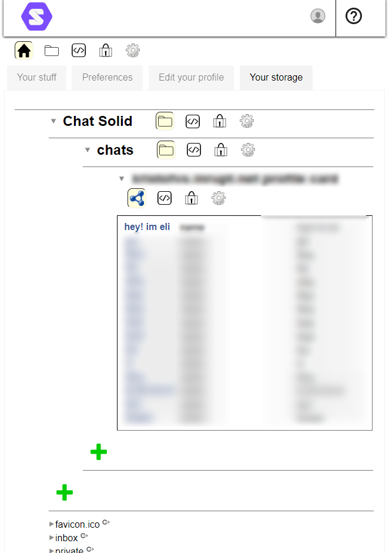

## React Solid Chat App

### Description

The inspiration to initiate this project was born during my undergraduate studies, where I was tasked with investigating
a cutting-edge and relatively unexplored topic in web technology. This assignment was set forth by Odisee, a renowned
educational institution located in Ghent, Belgium. This repository hosts a React-based chat application that leverages
decentralized data management using Solid principles
and Solid Project authentication. This app serves as a demonstration and open-source tool, encouraging the adoption and
implementation of Solid Project methodologies and Solid POD storage. The vision is to shape the future of the web into a
more user-centric platform. This application is built with React and utilizes @inrupt/solid packages for essential
authentication logic while trying to keep the code as simple as possible and trying to keep the dependencies to a
minimum. The implementation of Solid authentication and the usage of pod storage write/read is done in the - what I
found to
be - best, most practical and adaptable way for open-source, contribution and expandability purposes.

### Features

<!DOCTYPE html>
<html lang="en">
<head>
<meta charset="UTF-8">
<meta name="viewport" content="width=device-width, initial-scale=1.0">
</head>
<body>

<p float="left">

<div>

#### Not connected (Landing) - View:

The green buttons represent the (other than yourself) available peer's which can be "called" on press.

  
</div>

<div>

#### Authenticated and connected - View:

An established peer to peer connection where both user's are authenticated using their WebID the chatbox will display
the chat history if both authenticated user's have previously chatted with each other. The chat history is stored in the
peer's Solid POD storage but each user only stores their own sent messages and can only be merged together upon a
successful connection within this, and only this, application. Merging the user's chat history is done by the
application and is only based on the date each message was sent and based on that placed and displayed in their
respective chronological order.

  
</div>

<div>

#### Authenticated with WebID - View:

The user is authenticated using their WebID and can now call other users.

   
</div>

<div>

#### Calling peer user - View:

Calling another peer will disable the ability to start another connection until the call is either accepted or rejected.

  
</div>

<div>

#### Recieving call - View

The user is being called by another peer and can either accept or reject the call.

  
</div>

<div>

#### Solid pod browser 'Chat Solid' folder:

The folder in which the chat files are stored in the user's Solid POD storage.

  
</div>

<div>

#### Solid pod browser 'Chat Solid' folder's peer chat file (this file is named after the peer user's WebID):

The file in which the chat history is stored in the user's Solid POD storage. This file is named after the peer user's
WebID to ensure that each user has a unique file for each peer user and as an indicator for who the chat history (
containing only the pod's owner's messages) belongs/contributes to.

   
</div>

<div>

#### Responsive mobile chat - View:

For mobile devices the chat view is optimized to fit the screen and provide a good user experience. This is mainly done
for development purposes as all information is displayed on the same view.

  
</div>

<div>

#### Responsive mobile video - View:

For mobile devices the video view is optimized to fit the screen and provide a good user experience.

  
</div>

</p>

</body>
</html>

The messages are stored in the user's Solid POD storage as a file containing relevant information about each message
using the RDF/JS specification which are the Linked Data principles. Here's an example:

```turtle
@prefix : <#>.
@prefix foaf: <http://xmlns.com/foaf/0.1/>.

<#message-2024-01-30T22:49:03.718Z> foaf:name "Hey! im Eli".

<#message-2024-01-30T22:50:19.660Z> foaf:name "Nice to meet you too!".

<#message-2024-01-30T22:50:59.967Z> foaf:name "No, I am just looking around. Wby?".

<#message-2024-01-30T22:51:27.011Z> foaf:name "LOL!".

<#message-2024-01-30T22:51:58.193Z> foaf:name "That is very cool".
```  

It's important to note that the current way of storing messages is not the best practice way because Linked Data
principles are not fully implemented. 

All rules about storing data like messages, in a Solid pod, for chat-related applications can be found on the Solid Project website and
their github documentation, explained in great detail here: https://solid.github.io/chat/


### Table of Contents

1. Installation
2. Development Guidelines
3. Using Solid JavaScript Client
4. Issues and Community Help

### Installation

Depending on your preference, you can use either npm or yarn to install this package. Please change your package.json
scripts accordingly and only do so if you know what you are doing.

1. Run the Socket.io server for WebRTC communication
   (Using package manager NPM)

```bash
npm install
```

```bash
npm run build
```

```bash
npm run dev
```

2. Run the React application

```bash
cd client
```

```bash
npm install
```

```bash
npm run dev
```

```bash
npm run build
```

To incorporate this chat application into your project, make sure to install the following dependencies (which should be
present if you followed the steps above):

```bash
npm install -S @inrupt/solid-ui-react
```

#### Usage

Import components such as:

```js
import {SessionProvider, LoginButton} from "@inrupt/solid-ui-react";
```

### Development Guidelines

All development adheres to Inrupt (and Solid) Coding Guidelines. Our linting and testing tools largely automate this
compliance.

#### Getting Started

1. Clone the Repository
2. Install Dependencies
3. Start websocket server for WebRTC communication
4. Start the application

### Using Solid JavaScript Client

The @inrupt/solid-client is a JavaScript library for data access and permission management in Solid Pods. It abstracts
Solid and RDF principles and complies with the RDF/JS specification. solid-client is usable in Node.js with CommonJS
modules or in browsers with bundlers like Webpack, Rollup, or Parcel.

This client is part of Inrupt's open-source JavaScript library suite for Solid app development.

### Issues and Community Help

If you need help or have a question you can contact me at: eli.vanstichelen@student.odisee.be

#### Solid Community Forum

For questions about Solid or sharing your work, visit the Solid forum. It's a great place to engage with the community.

#### Bugs and Feature Requests

Public Feedback: File an issue via GitHub.
Private Feedback or Support: Contact us through the Inrupt Service Desk.

### Contributing

The main focus of this project is to provide a solid chat application that can be used by anyone. If you want to
contribute to this project, don't hesitate and try it out.

### Feedback

For feedback, please raise issues in the issue section of the repository or contact me at:
eli.vanstichelen@student.odisee.be. All feedback is welcome!

### License

This project is licensed under the GNU General Public License v3.0 (GPL-3.0). This license is chosen to ensure that all
modifications and derivatives of this project remain free and open-source. The GPL-3.0 license aligns with the goal of
contributing to the community-driven Solid project, ensuring that my work and any extensions of it continue to benefit
the open-source ecosystem.